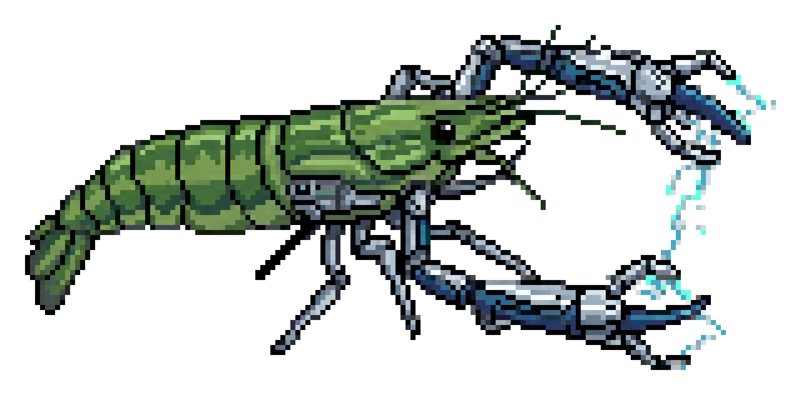

``` 
                        ██╗
                       ██╔╝
██████╗ ██╗████████╗   ╚═╝
██╔══██╗██║╚══██╔══╝██╗   ██╗
██████╔╝██║   ██║   ██║   ██║
██╔═══╝ ██║   ██║   ██║   ██║
██║     ██║   ██║   ╚██████╔╝
╚═╝     ╚═╝   ╚═╝    ╚═════╝
```
**/peeh-tooh/** · _Make it yours_

---

## A lean lobster

While other claw agents grow heavier with every release — runtimes, registries, cloud dashboards, proprietary skill stores, vendor-locked model choices — Pitú stays small on purpose.

Pitú is a **bootstrap agent kernel**: a local-first harness that receives messages from a frontend (Telegram by default), dispatches them to AI agents running inside rootless Podman containers, and delivers responses back through the same channel. Every interaction is mediated through filesystem-based IPC — no daemons, no sockets, no cloud accounts required.

It is built entirely on open source foundations: [Podman](https://podman.io) for rootless containers, [OpenCode](https://opencode.ai) as the in-container agent runtime, and standard Go tooling for the harness itself. You choose your model provider — Anthropic, OpenAI, Ollama, or any OpenAI-compatible endpoint. No proprietary harness, no forced subscription, no telemetry.

Pitú is a **thin orchestrator** — OpenCode does the agent heavy lifting (model calls, tool use, session state). The harness only does what agents cannot: manage containers, route IPC, enforce rate limits, and persist state. That division of responsibility is what keeps the codebase small.

Out of the box, a default installation includes a minimal but complete set of capabilities: **Telegram frontend** for sending and receiving messages, **cron-style scheduled tasks** agents can create at runtime, **multi-agent spawning** so an agent can delegate work to specialised sub-agents, and **two-tier memory** — short-term context kept alive within a warm container session, and a persistent `CONTEXT.md` scratch-pad the agent writes to and reads from across sessions. All of this works without touching configuration.

The entire core orchestrator fits in **~15 source files and under 4,000 lines of Go**. You can read it in an afternoon. Your companion agent can read it in seconds. Both of you can understand it, modify it, and extend it — because that is exactly the point.

---

## Skill-based extensibility

New capabilities come as **skills** — Markdown files with YAML frontmatter that follow the [AgentSkills specification](https://agentskills.io/specification). Skills are mounted read-only into every agent container at startup and listed in the agent's context automatically.

Bundled skills cover setup, model configuration, container tuning, and session inspection. User skills live in `~/.agents/skills/` or `~/.pitu/skills/` and take precedence over bundled ones. There is no plugin registry, no package manager, no approval process — drop a file, restart, done.

For the full discovery order, merge rules, and how skills interact with the agent context system, see [`docs/ARCHITECTURE.md`](docs/ARCHITECTURE.md).

---

## Security by smallness

A small codebase is an auditable codebase. Pitú's security posture is a direct consequence of its size constraint:

- Agents run in **rootless Podman containers** — a container escape lands a non-root user, not root.
- All harness ↔ agent communication is **filesystem IPC** scoped to per-chat directories. Agents cannot reach arbitrary chats, sockets, or localhost ports.
- **Path-derived identity**: the harness overwrites the `chat_id` in every IPC payload with the value it controls — a prompt-injected agent cannot forge routing.
- **No secrets in transit**: API keys are written to a `0600` temp file, read by Podman at start, then deleted from the host.
- Warm containers are bounded by a configurable **TTL** and a per-container **memory limit**.

Every one of these decisions is deliberate and documented. For the full threat model and rationale, see [`docs/SECURITY.md`](docs/SECURITY.md).

---

## Contributing: skills, not PRs

Pitú's contribution model mirrors its extensibility model — new features live as skills, not as commits to the core.

Want WhatsApp integration? Write a skill that instructs users to have their own agent implement a companion bridge process. Want a richer task UI? Write a skill. Want to bundle a persona template, a new memory workflow, or a deployment helper? Write a skill.

This keeps the core repo at ~4,000 lines and every operator's fork clean and auditable. **Pitú accepts:**

- Security fixes
- Bug fixes
- New bundled skill proposals (as `.agents/skills/<name>/SKILL.md`)

**Feature pull requests to the core are declined by design.** If you want to contribute a skill or a fix:

1. **Fork** the repository — do not clone directly.
2. Make your changes in your fork.
3. Open a **merge request** against `main`.

This keeps the upstream repo lean and the contribution history meaningful. Feature work belongs in forks, operator configs, and skill files — not in the shared kernel.

---

## Quick start

The recommended way to install Pitú is to let your agent do it. The bundled `setup` skill contains instructions clear enough that any capable model can execute them end-to-end without hand-holding — **any agent harness works**. Below are reference examples for three common ones:

**[OpenCode](https://opencode.ai) (recommended)**

```sh
opencode
> skills          # open the skill picker
> select: setup   # run the setup skill
```

**[Claude Code](https://claude.ai/code)**

```sh
claude
> /setup
```

**[Gemini CLI](https://github.com/google-gemini/gemini-cli)**

```sh
gemini
> /setup
```

[Kilo Code](https://kilocode.ai), [Crush](https://github.com/charmbracelet/crush), [Goose](https://github.com/block/goose), and any other agent that can read Markdown and run shell commands will work equally well — just point it at the `setup` skill and let it run.

Your agent will clone the repository, build the binaries, scaffold the config, and install the system service — asking you only for the things it cannot infer (your model provider, API key, and Telegram bot token).

---

## Agent-first development

Pitú is built to be explored, debugged, and extended by you _with_ your agent — not by reading API docs or joining a Discord server. Any capable agent and model works; the codebase is small enough to fit entirely in context.

- **Want to understand the code?** Point your agent at `internal/` and ask it to walk you through a request's lifecycle from Telegram poll to container exec.
- **Building a new feature?** Have your agent read `docs/ARCHITECTURE.md`, then draft the implementation together against the documented invariants.
- **Debugging something unexpected?** Ask your agent to tail the logs, trace the IPC files, and explain what each component is doing.
- **Exploring new ideas?** Share the source with your agent and brainstorm. The codebase is small enough that your agent holds the whole thing in context at once.

This is the _make it yours_ ethos in practice — not a plugin marketplace, but a shared workspace between you and a capable collaborator.

---

### A note on where this is heading

Pitú is a small bet on a larger idea.

If LLMs continue to improve at the current pace, the relationship between developers and code will shift. Source code will increasingly become a _side effect_ of functional and non-functional requirements — the artefact a system produces to satisfy a spec, rather than the thing humans author directly. Two instances of the same application could behave identically but be implemented in completely different languages, with different abstractions, generated fresh for different runtime environments.

In that world, what matters is the spec, the behaviour, and the tests that validate the behaviour as a black box. The implementation language, the framework, even the operating system become incidental.

Pitú is built for that direction: keep the kernel small enough to specify precisely, keep the extension surface in plain text (skills, Markdown, TOML), and let agents handle the rest. The goal is not a better bot platform — it is a working example of what software looks like when it is built to be understood and modified by agents as naturally as by humans.

---

## License

[MIT](LICENSE)
